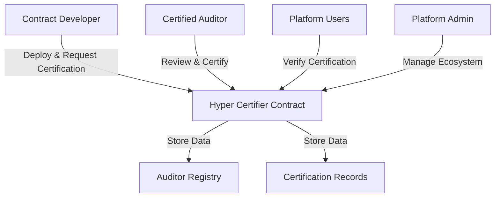

# Bip Hyper Stack: Smart Contract Certification Platform

A decentralized trust verification ecosystem for smart contracts on the Stacks blockchain, providing transparent and reliable contract certification through expert auditing.

## 🌐 Overview

Bip Hyper Stack bridges the trust gap in decentralized systems by offering a comprehensive platform for:
- Smart contract certification
- Auditor reputation management
- Transparent verification processes
- Immutable certification tracking

## 🏗️ Architecture



### 🔑 Core Components
- **Auditor Registry**: Manages qualified auditors and credentials
- **Certification Engine**: Handles certification requests and issuance
- **Verification Mechanism**: Provides public trust verification endpoints
- **Reputation System**: Tracks auditor performance and reliability

## 📦 Getting Started

### Prerequisites
- Clarinet
- Stacks Wallet
- Basic understanding of smart contract interactions

### Installation
1. Clone the repository
2. Install dependencies
3. Configure Clarinet environment

### Basic Usage

#### Request Contract Certification
```clarity
(contract-call? 
  .hyper-certifier 
  request-certification 
  contract-principal 
  "1.0.0" 
  "Detailed contract description" 
  "https://github.com/your-repo")
```

#### Verify Contract Certification
```clarity
(contract-call? 
  .hyper-certifier 
  verify-contract-certification 
  contract-principal 
  "1.0.0")
```

## Contract Documentation

### hyper-certifier.clar

The core contract managing the Bip Hyper Stack certification ecosystem.

#### Key Features
- Auditor registration and management
- Certification request handling
- Transparent verification endpoints
- Auditor reputation tracking

## 🛡️ Security Considerations

- Always verify contract certification before interaction
- Check auditor reputation and history
- Understand that certification doesn't guarantee absolute security
- Regularly recertify critical contracts

## 🤝 Contributing

1. Fork the repository
2. Create a feature branch
3. Implement your changes
4. Submit a pull request

## 📄 License

[Specify your license here]

## 📞 Contact

[Your contact information or project support channels]